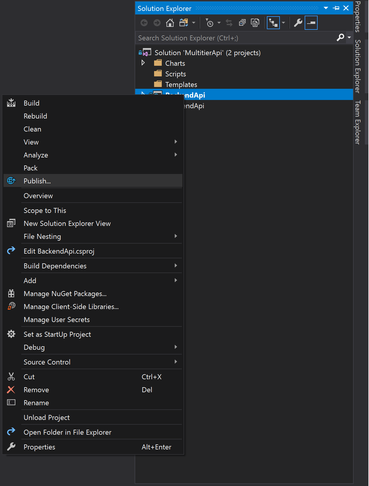
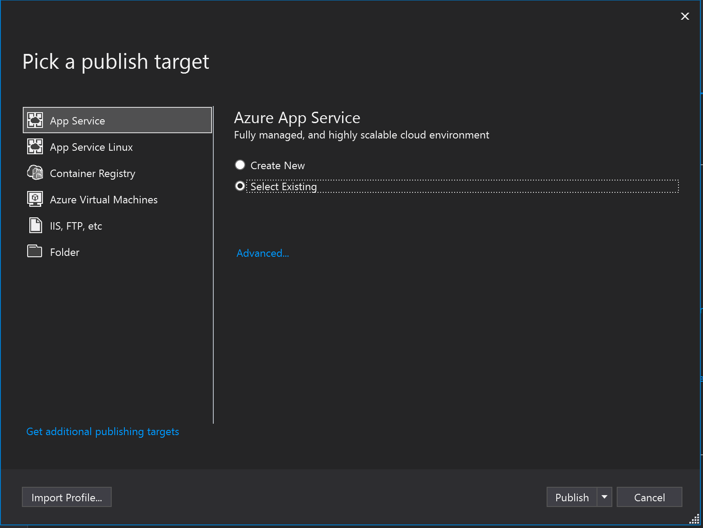
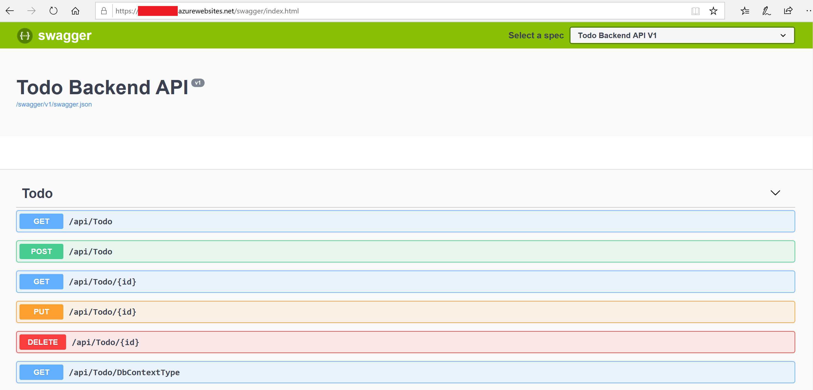
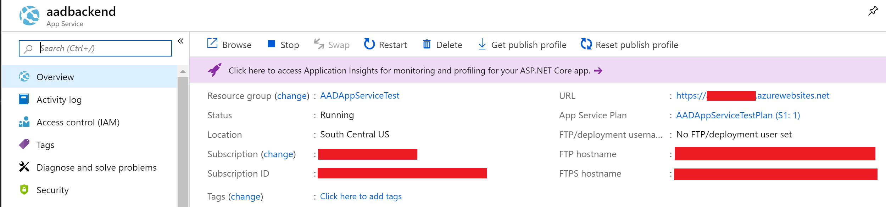
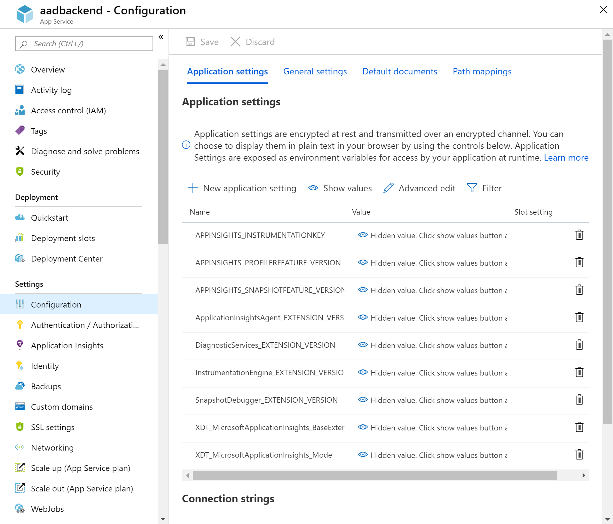
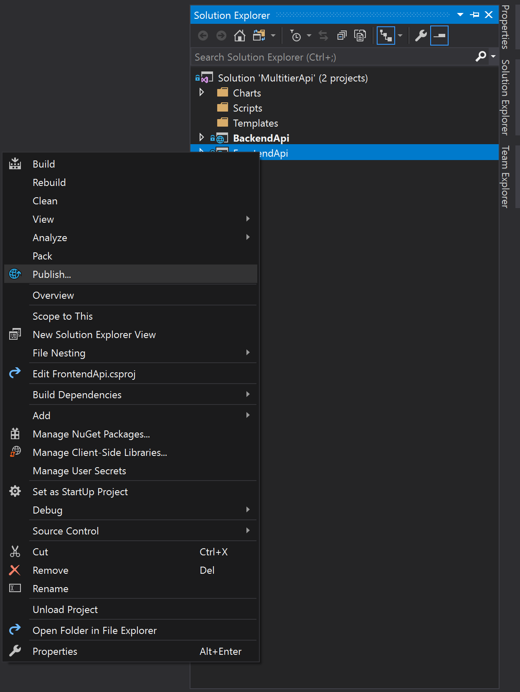
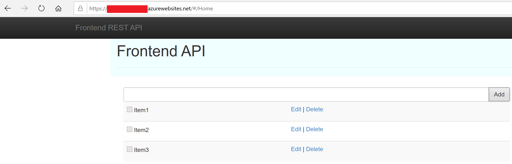

# App Service AAD Sign-In Integration
This repo demonstrate how to configure Azure App Services to use Azure AD sign-in. For a full breakdown of the workflow, you can refer to the [Microsoft documentation](https://docs.microsoft.com/en-us/azure/app-service/app-service-web-tutorial-auth-aad).

The code in this repo consists of two .NET Core applications:BbackendApi and FrontendApi.

## Pre-requisites
> [!NOTE]
    > You can choose not to install any CLI on your computer and either create an [Azure data Science VM](https://docs.microsoft.com/en-us/azure/machine-learning/data-science-virtual-machine/provision-vm), or use the [Azure Cloud Shell](https://shell.azure.com).

* Install Azure CLI [here](https://docs.microsoft.com/en-us/cli/azure/install-azure-cli?view=azure-cli-latest)
* Install Visual Studio 2017, community version will work for the scope of this exercise. Download it [here](https://visualstudio.microsoft.com/downloads/).

* Clone this repo, ```git clone https://github.com/marvin-garcia/AppServiceAADIntegration.git```

## Backend API
The [Backend API](BackendApi/) provides access to a To-Do list that gets stored in the data layer. It can connect to a MongoDB as long as the environment variable ```mongodb``` exists and contains a valid DB connection string. If it doesn't, it will provide a DB context using an in-memory DB through Entity Framework. For more details on what environment varialbles to configure in order to connect to a Mongo DB, check the [appsettings.json](MultitierApi/BackendApi/appsettings.json) file.

## Frontend API
The [Frontend API](MultitierApi/) provides a user interface to interact with the data layer. It sends requests to the Backend API for CRUD (create, read, update, delete) operations in the To-Do list. The solution needs the environment variable ```backendurl``` to point to the Backend API Url.

> [!NOTE]
  > Both APIs have a Swagger definition that can be accessed at ```http://site-name.azurewebsites.net/swagger.index.html```.

## Create the web apps
In order to create a web app on Azure you need a resource group to contain your resources and an App Service plan; the last one will determine the SKU for your web app in terms of computing resources, scalability, isolation and additional features. You can create these resources using Azure PowerShell, Azure CLI or the Azure portal, in this exercise we will be using Azure CLI. Open the file [create-app-services.ps1](Scripts/create-app-services.ps1), fill the required parameters and run it in your Azure subscription.

## Publish Backend API
Use Visual Studio either on your local computer or the Data Science VM to open the solution by opening the file [MultitierApi.sln](MultitierApi/MultitierApi.sln). On the Solution Explorer window, right-click the BackendApi item and select ```Publish```.



Select **App Service** as the publish target and choose the **existing** option on the right side, then click **Publish**. In the next window find the backend web app you created on Azure and finish the operation. 



After a few seconds the app will be published to your web app and it will open the website on your browser, the request will fail because the backend API doesn't have a home page. Edit the site Url and add ```/swagger/index.html``` to reach out to the Swagger page.
 

 
## Test Backend API
If you were able to see the Swagger page it means your application was successfully published. The Backend API uses an in-memory DB if no MongoDB connection string was provided so it is ready to use right after creation. You can test any of the endpoints through the Swagger page, try the ```GET``` and ```PUT``` methods and see new items being added to the To-Do list.
 
## Publish Frontend API
This time you will repeat almost the same steps you did for the Backend API, but before you do it you need to add the Backend API Url to the frontend API's environment variables. Go to the Azure portal and find your backend web app, you will find the Url in the Overview section. Copy the Backend Api URL.


 
This time you have to find the frontend web app, select **Configuration** in the **Settings** section, click on the **Application Settings** tab and select **New Application Setting**. In the **Name** field type ```backendurl```, in the **Value** field paste the URL you just copied and click **Update**. In order for changes to take effect you need to click **Save** on the top of the view.



> ![NOTE]
  >At this point, the steps are almost identical to publishing the Backend API.

In the Visual Studio Solution Explorer window, right-click the FrontendApi item and select ```Publish```.



Select **App Service** as the publish target and choose the **existing** option on the right side, then click **Publish**. In the next window find the frontend web app you created on Azure and finish the operation. 


After a few seconds the app will be published to your web app and it will open the website on your browser, the request will take you to the Frontend API Home page. If the connectivity with the Backend API works, you should see at least one item listed below the bar. Use the Home page to add, edit and delete a few items from the list.



> ![NOTE]
    > At this point you have successfully published both APIs and configured them to work together. The next step is to secure both APIs by integrating them with Azure AD.

# Integrate App Service with Azure Active Directory
Because App Service provides built-in authentication and authorization support, you can sign-in users with minimal or no code changes to your application. The way it works is that every request to your web app reaches tothe authentication and authorization module first and it is responsible for token management, and user authentication. If needed, you can ask for these tokens and claims to be exposed to your code so you can do other things like integrating with Microsoft Graph API. App Service also allows you to authenticate against different providers, you can choose between Azure AD, Google, Facebook, etc. You can read more about it in details [here](https://docs.microsoft.com/en-us/azure/app-service/overview-authentication-authorization). 

## Register AD App for backend API
In order to enable sign-in in your web app through Azure AD, you first need to register a new App with an Azure Active Directory. In your Azure portal go to **Azure Active Directory** > **App registrations (Preview)** > **New registration**.

>![NOTE]
    > Keep in mind that an Azure website can use a different Azure tenant than the one it lives in. In this exercise we won't make any assumptions and will configure the app services as if they live in different tenants, but the steps are relatively the same.

- Assign a distinctive name to your app that relates it to the Backend API easily.
- Select **Accounts in this organizational directory only (Microsoft)** in the account type.
- Add the Url ```http://<site-name>.azurewebsites.net/.auth/login/aad/callback``` to the **Redirect URI**. Make sure to replace ```<site-name>``` with your backend API web app name.
- Finish the process by registering the app.
- Once the app has been registered, go to **View API Permissions**, make sure the app has the **delegated** **User.Read** permission for the **Microsoft Graph** API.
- Go to **Authentcation** and enable the options to **Access tokens** and **ID tokens**. Click **Save**.
- Go to **Expose an API** and click **Add a scope** to your app. Make sure that **Admins and users** can consent to the app scope. Choose any name, display and description to both admin and user consents. Click **Save**.
- Go to **Certificates & secrets** and create a new secret. Make sure to copy its value once it's been created since it won't be visible after you close the tab.
- Go to **Overview** and copy the **Application (client) ID** and the **Directory (tenant) ID**. You will need them later.

## Enable App Service authentication for the backend API
Now that you have registered the backend API app in Azure AD, it's time to configure Authentication/Authorization.

- Locate the backend API in the Azure portal, go to **Authentication/Authorization**. Turn it on and change the **action to take when request is not authenticated** from **Allow Anonymous requests (no action)** to **Log in with Azure Active Directory**.
- Click to configure **Azure Actve Directory** under **Authentication Providers**. In **Management mode** select **Advanced**. 
- Under **Client ID** paste the app client ID that you copied before.
- Under **Issuer Url** type ```https://sts.windows.net/<tenant-id>/```. Make sure to replace ```<tenant-id>``` with the tenant ID you copied before.
- Under **Client secret** paste the app password you created before.
- Under **Allowed token audiences** paste ```http://<site-name>.azurewebsites.net/.auth/login/aad/callback```. Make sure to replace ```<site-name>``` with your backend API web app name.
- Click **OK** to go back to the previous menu.
- Click **Save**.

Now that the app service has been configured to use Azure AD, let's test it. Open your browser in private mode and go to ```http://<site-name>.azurewebsites.net/swagger/index.html```. Make sure to replace ```<site-name>``` with your backend API web app name.
